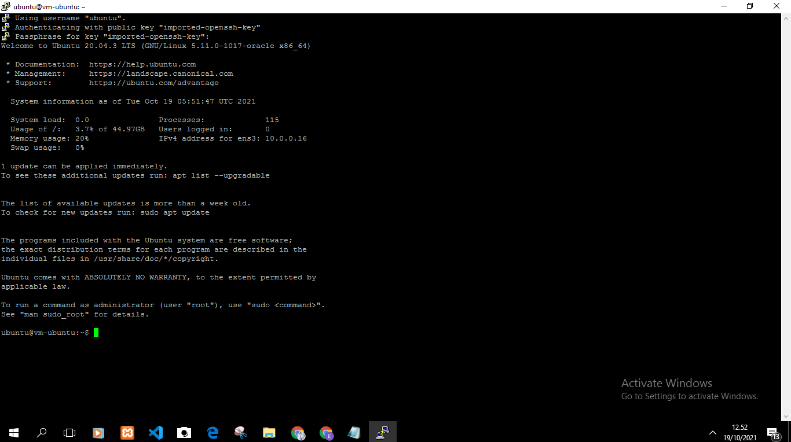

# 03 - Membuat Virtual Machine

## Tujuan Pembelajaran

1. Mengetahui Layanan Oracle cloud Infrastrukture Compute 
2. Mampu membuat virtual machine (VM) di Layanan compute Oracle Cloud 

## Hasil Praktikum

Berikut ini adalah bukti telah berhasil login ke halaman beranda akun oracle cloud.

proses Koneksi ke Virtual Machine 

