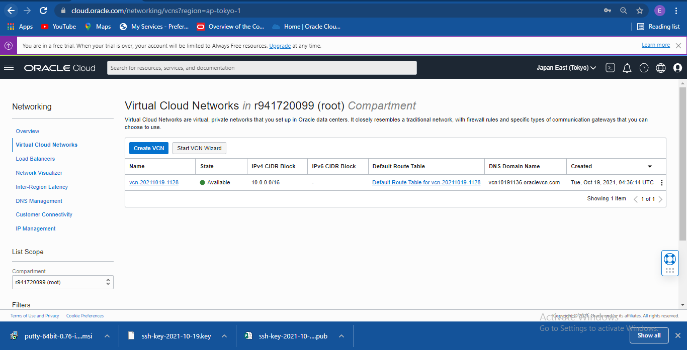
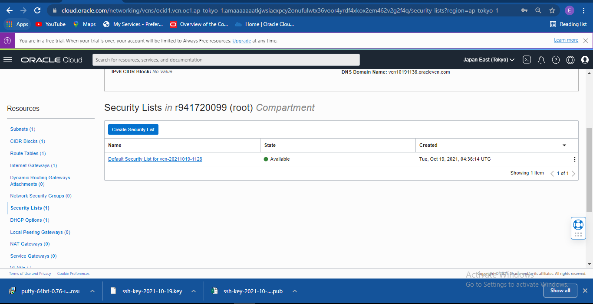
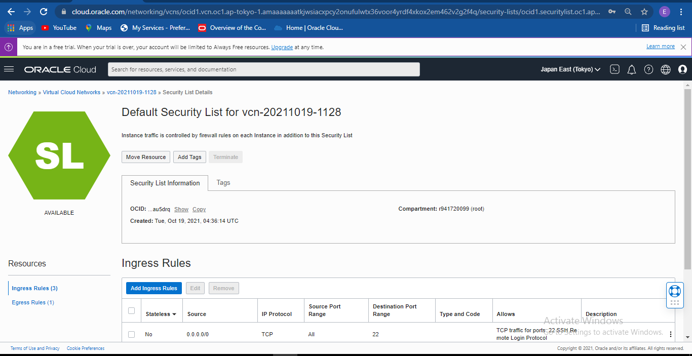
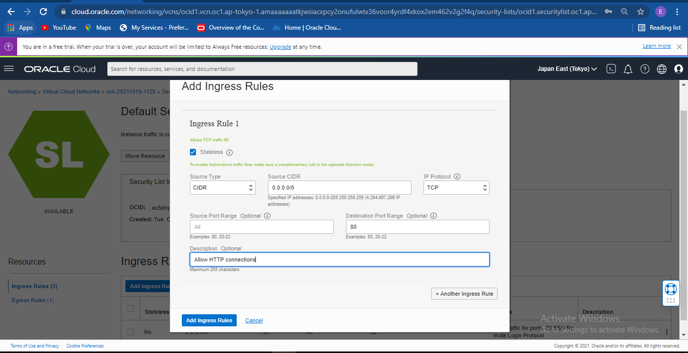
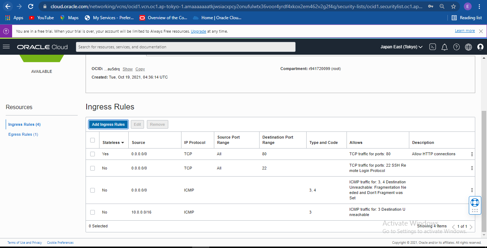
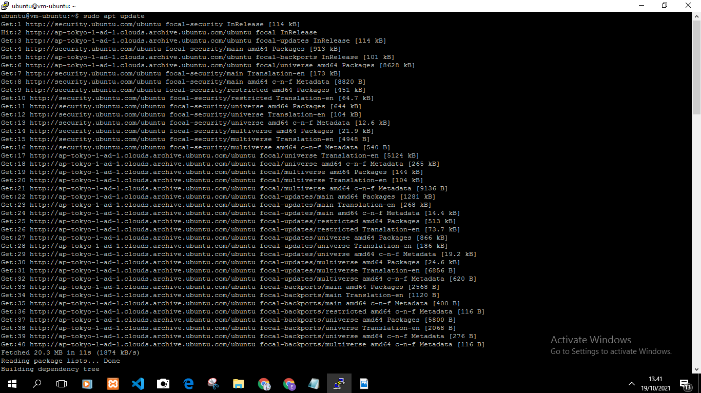
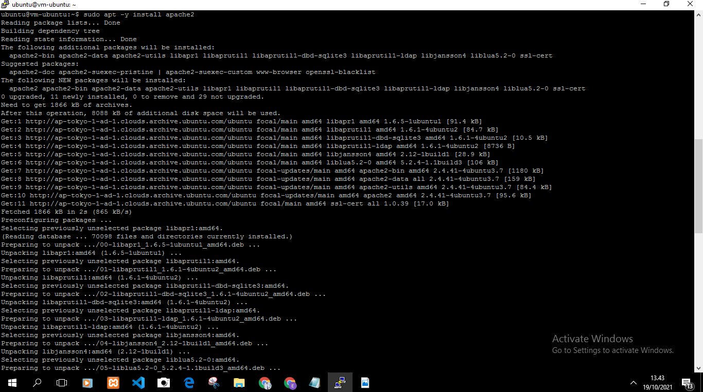
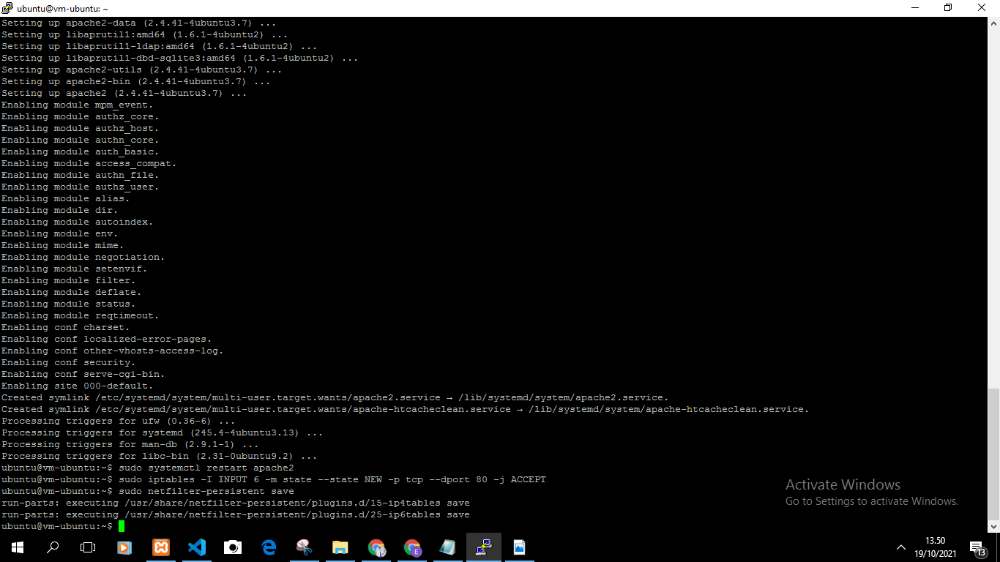
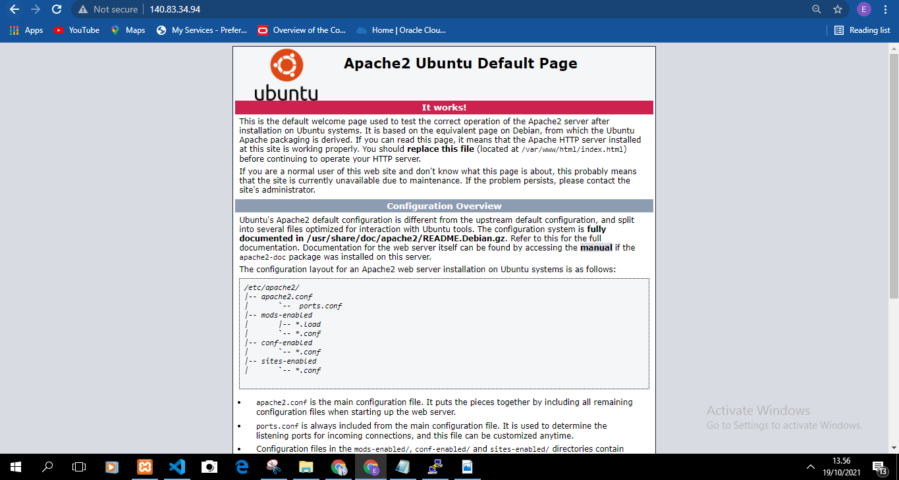
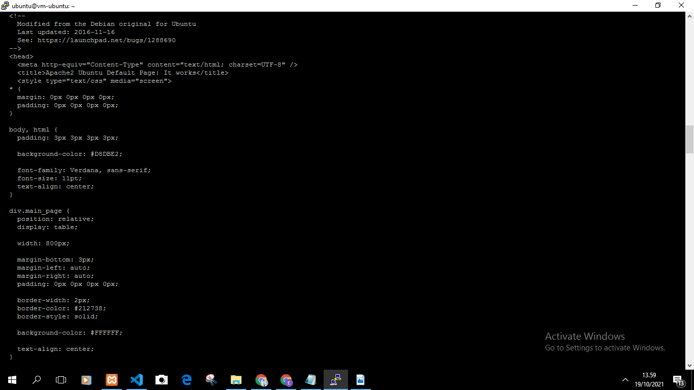

##04 _ VIRTUAL CLOUD NETWORK
(VCN)

Tujuan Pembelajaran 
1. mengetahui layanan oracle cloud Infrastucture Networking
2. mampu mengaktifkan port 80 melalui irtual Cloud Network (VCN) Di layanan Oracle Cloud 
3. Mampu memamsang Apchache server dan mengkonfigurasi ip tables firewalalls

Hasil Praktikum 
langkah 3 

