##05 PLATFORM AS A SERVICE (PASS)
Tujuan Pembelajaraan 
1. Mengetahui layanan Oracle Cloud Infrastructur Networking
2. Mampu Memasang Apchace server dan mengkonfigurasi ip firewal 

HASIL PRAKTIKUM 

Create Mysql
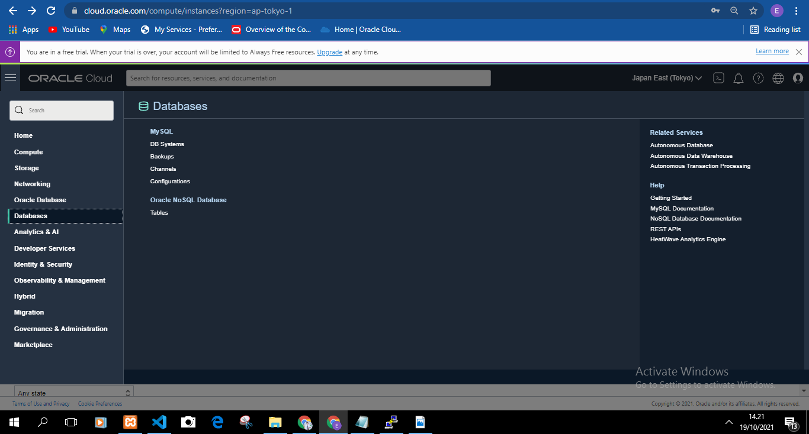
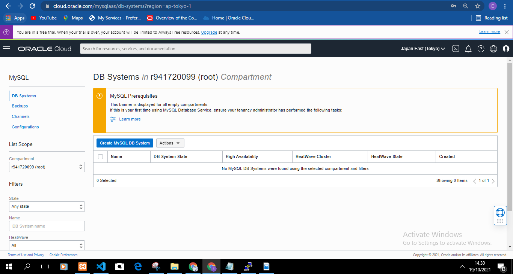
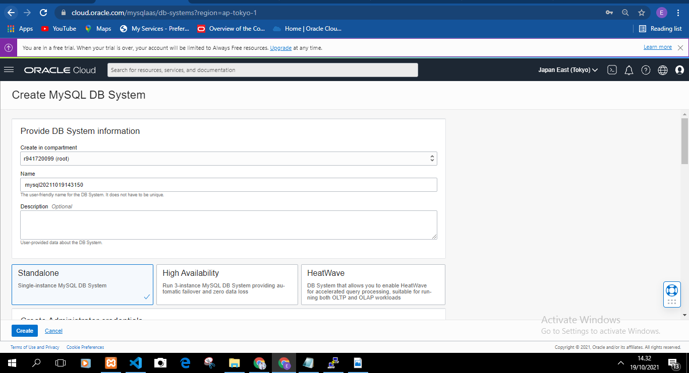
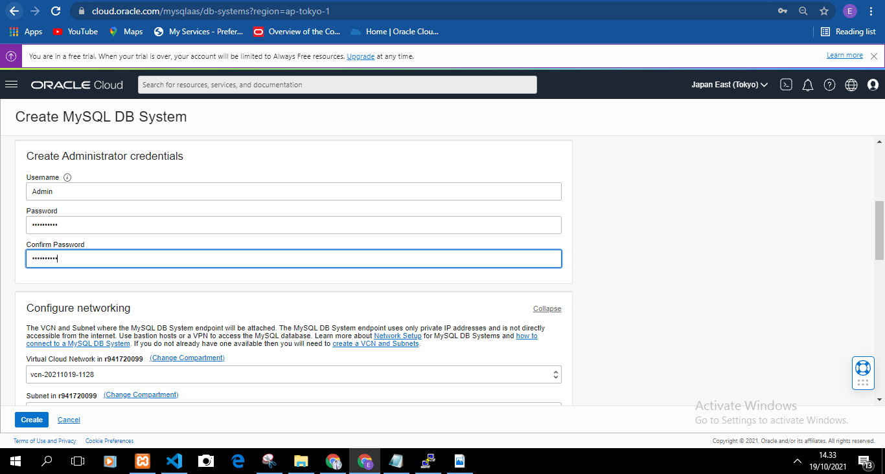
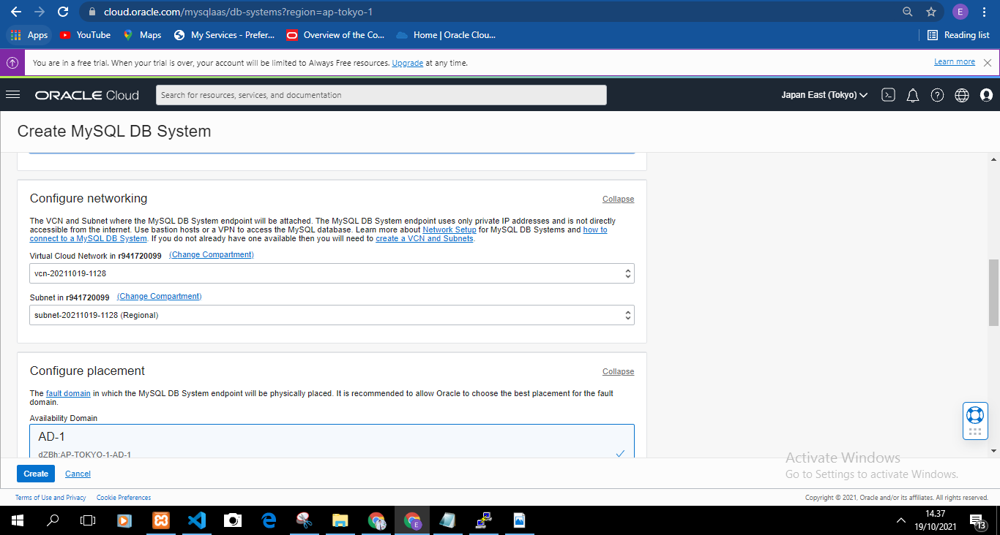
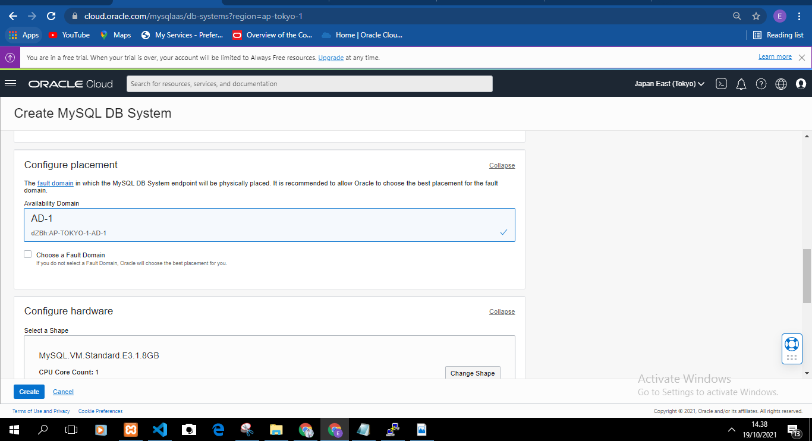
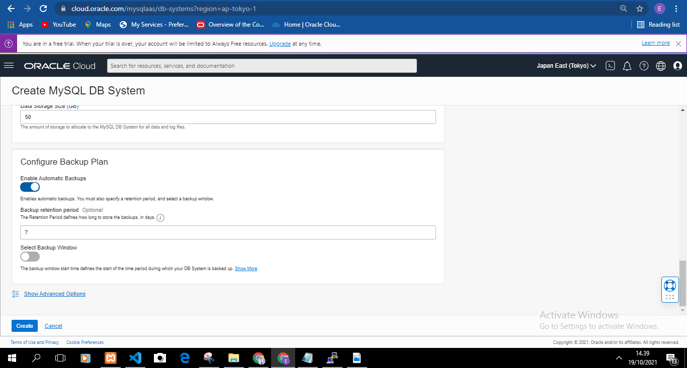
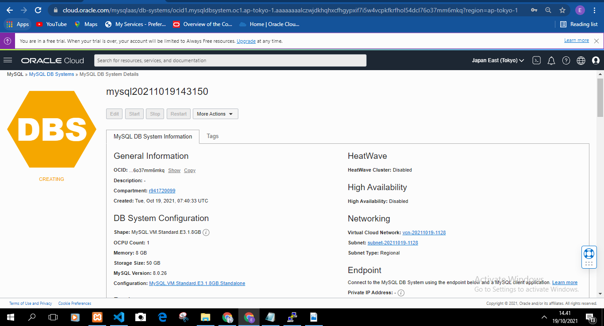
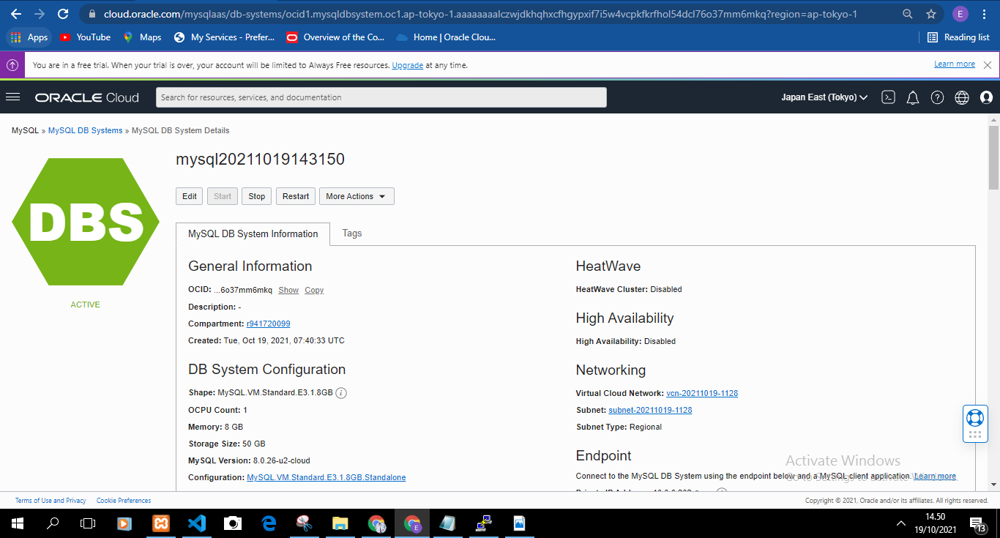
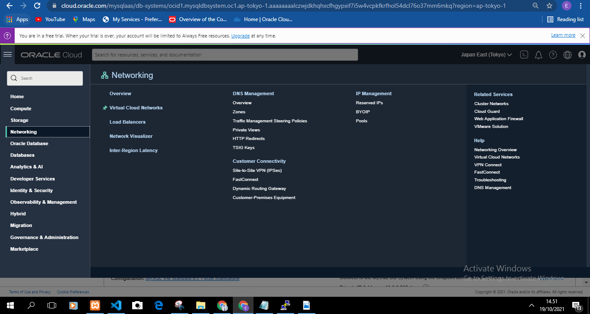
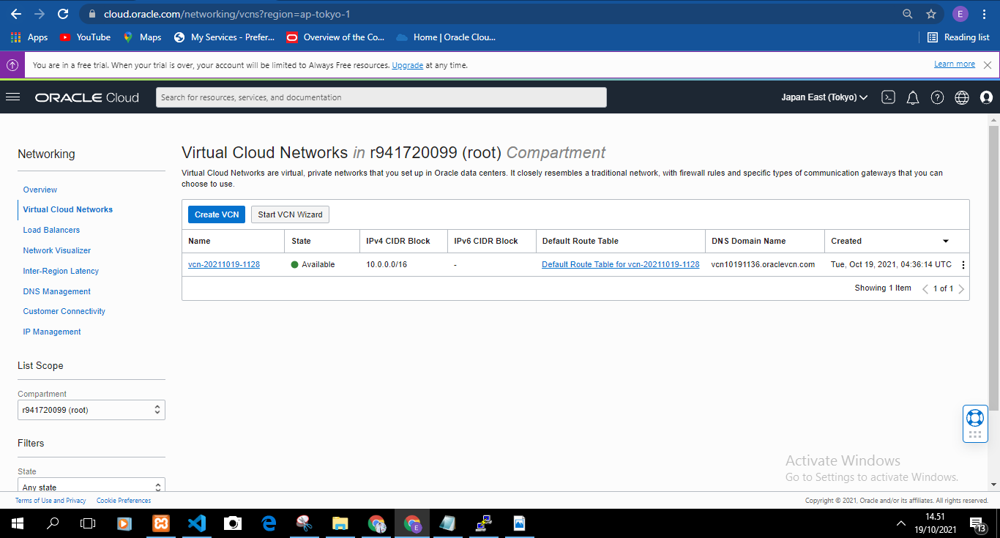
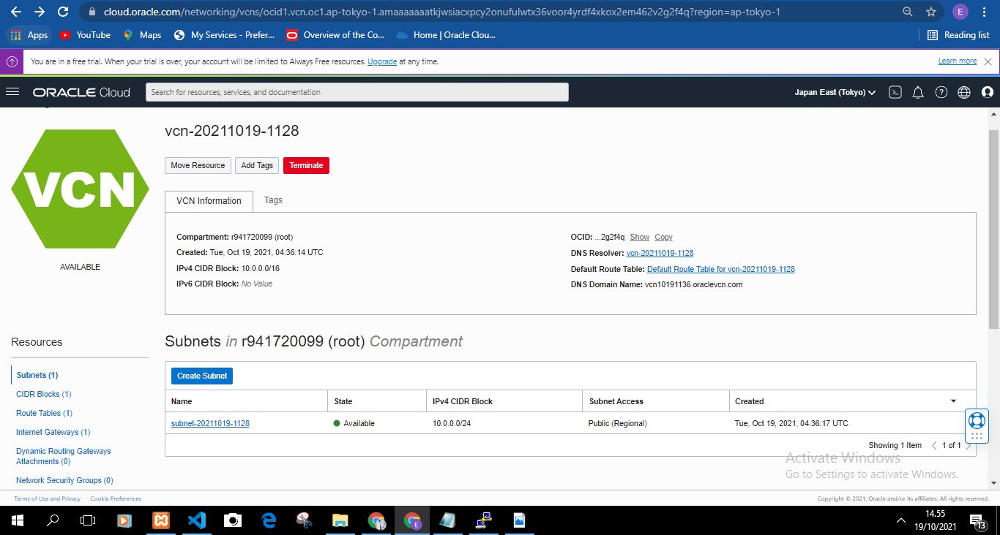
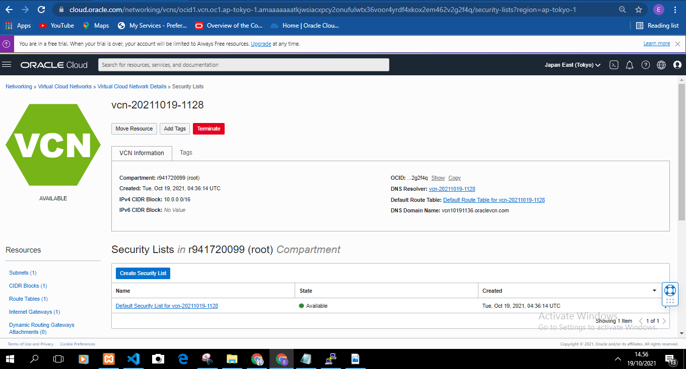
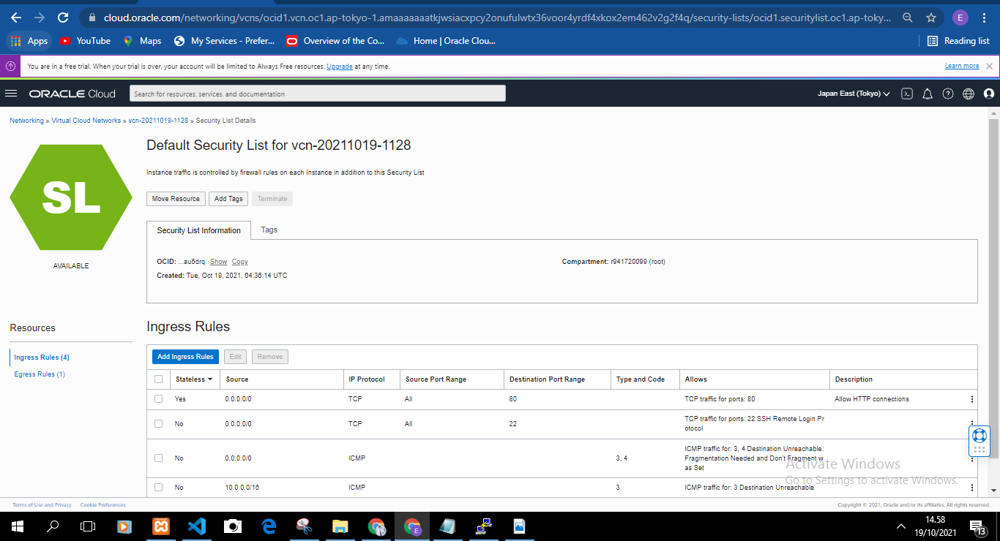
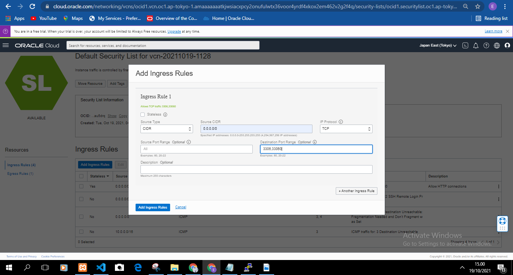

INSTALL PHP DI VM ORACLE
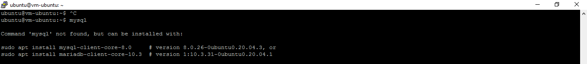
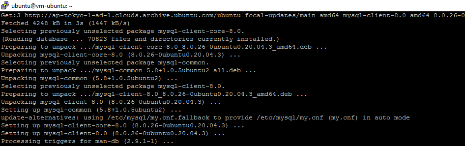

