O6 - KUIS 

langkah 1 membuat data base yang di butuhkan 
Disini saya menggunakan proyek website restoran berikut langkah – langkah pengerjaannya :

Langkah 12: Mengakses MySQL dari Melalui SSH 
Untuk mengakses mysql yang telah buat dengan cara sebagai berikut: A. Cara untuk mengakses instances yang dimiliki melalui ssh adalah dengan mengetik perintah sudo ssh -I username@ip public. Contoh penggunaan perintah tersebut adalah adalah sebagai berikut:
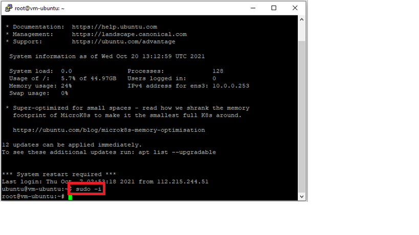

Langkah 13 : Mengakses MySQL 
Setelah berhasil masuk ke instances yang dimiliki anda dapat mengakses mysql anda akan tetapi anda harus menginstall mysql client. Jika anda tidak memiliki mysql client maka anda akan mendapat pesan seperti berikut:
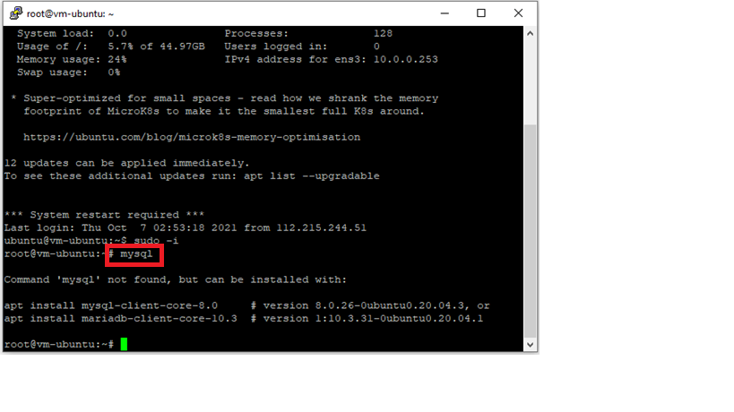

Cara Install MySQL Client:
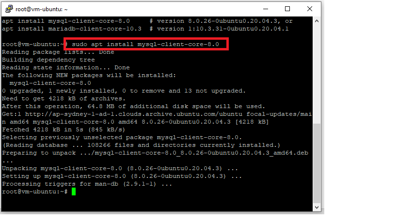

Untuk mengkoneksikan mysql dengan perintah berikut mysql -u -p -h . Setelah ini database sudah siap untuk digunakan sesuai dengan kebutuhan Anda.
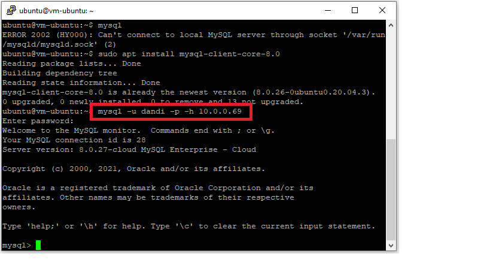

Langkah 14 : Install Wordpress Pada PaaS 
Cara untuk menginstall wordpress pada OCI dapat menggunakan langkah-langkah seperti berikut: 
A.	Membuat Database 
Cara untuk membuat database pada mysql adalah dengan mengetik perintah di bawah ini.Perintah pertama untuk membuat database, perintah kedua untuk melihat apakah database kita sudah berhasil dibuat dan ketiga adalah memberikan previleges database pada user admin. Anda dapat membuat user baru dan mengatur previlegenya.
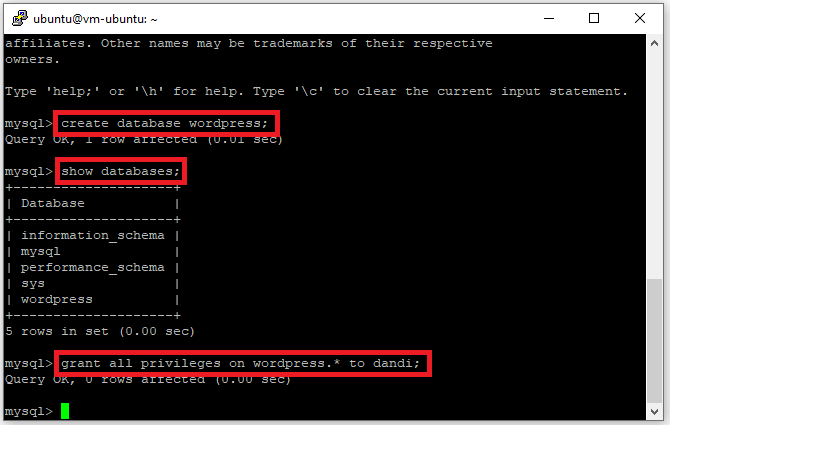
B.	Download Wordpress Pada Folder /var/www/html dengan perintah
wget https://wordpress.org/latest.tar.gz;
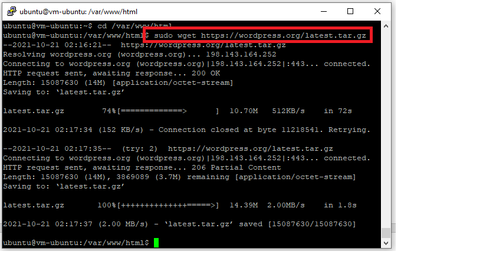
C.	Mengetrak Wordpress Pada Folder /var/www/html dengan perintah
tar zxvf latest.tar.gz
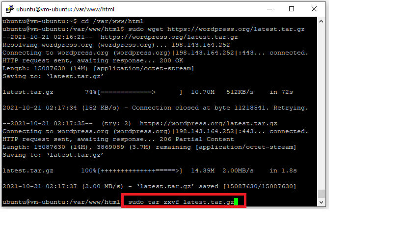
Selanjutnya setelah estrak file hasil download dapat dihapus dengan menggunakan perintah

sudo rm rf latest.tar.gz
D.	Selanjutnya menginstall extension mysql pada php dan mengaktifkannya pada php.ini. 
Berikut adalah perintah untuk menginstall extenstion mysql pada php.

sudo apt-get install php-mysql
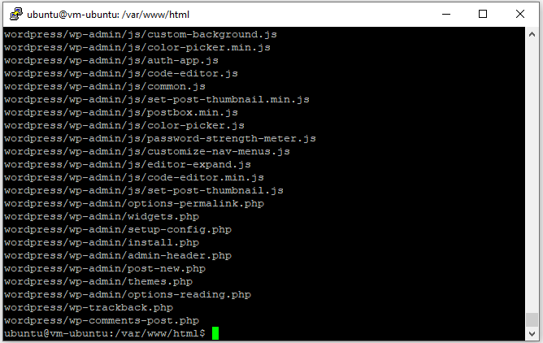

Masukkan perintah berikut : 
Sudo apt install libapache2-mod-php
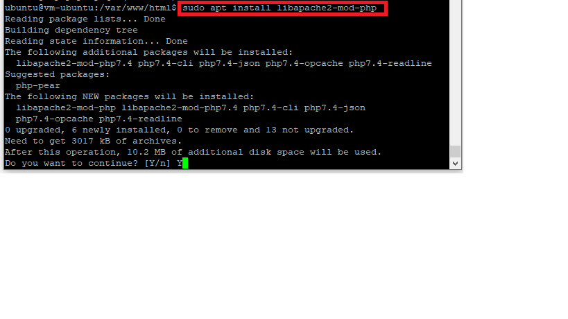

Masukkan perintah berikut : 
Sudo apt install php
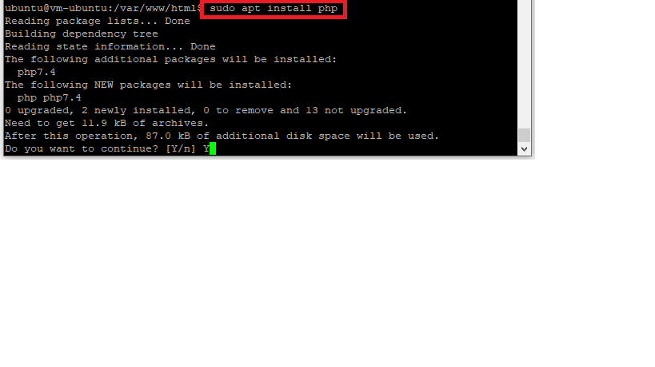

Sedangkan cara untuk mengaktifkan extension mysql pada php dapat diaktifkan pada php.ini. Path dari php.ini dapat dilihat pada phpinfo() seperti pada gambar berikut terletah pada /etc/php/7.4/apache2/php.ini.
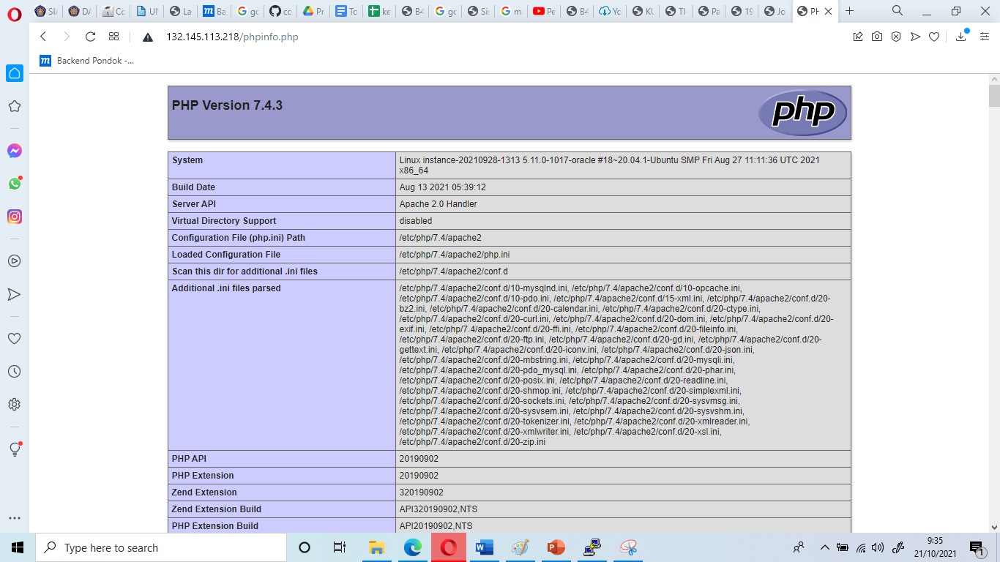

Pada php.ini aktifkan extension=php_mysqli.dll kemudian lakukan restart apache menggunakan perintah berikut.
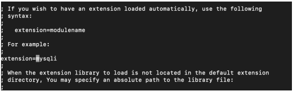

sudo service apache2 restart 
sudo chown www-data:www-data -R *
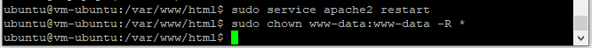

E.	Selanjutnya Proses Intalasi Wordpress Melalui Browser

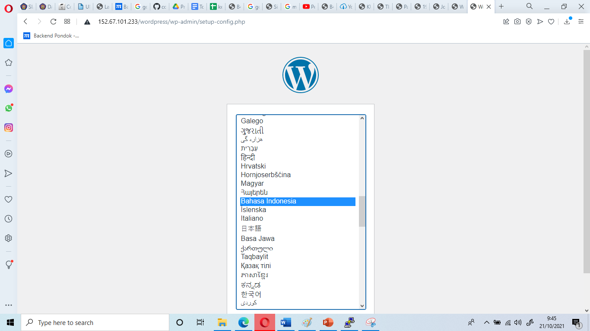
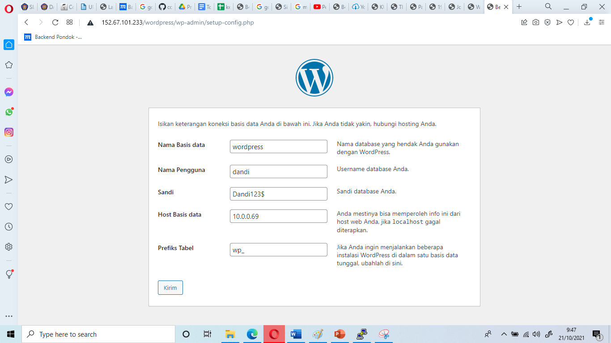
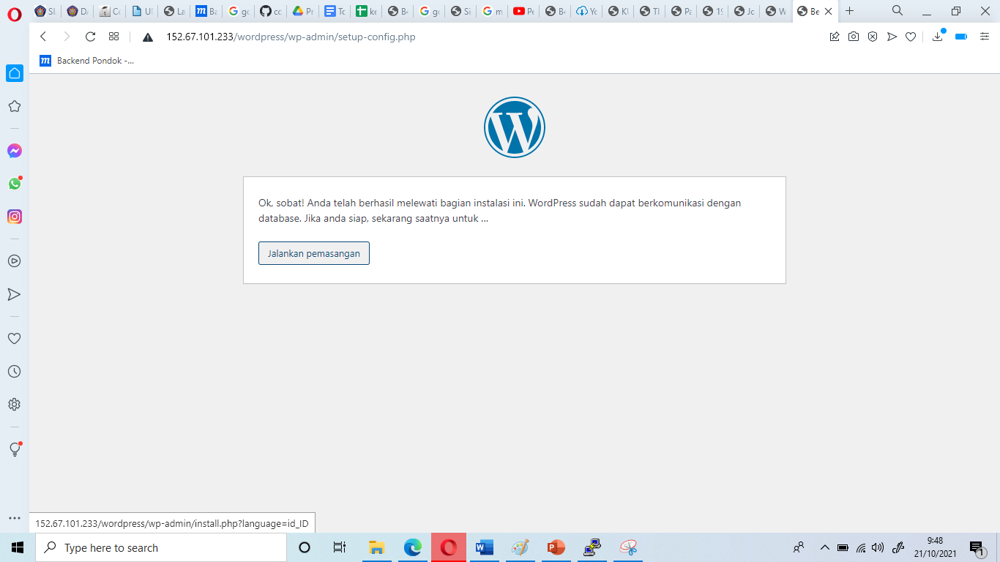
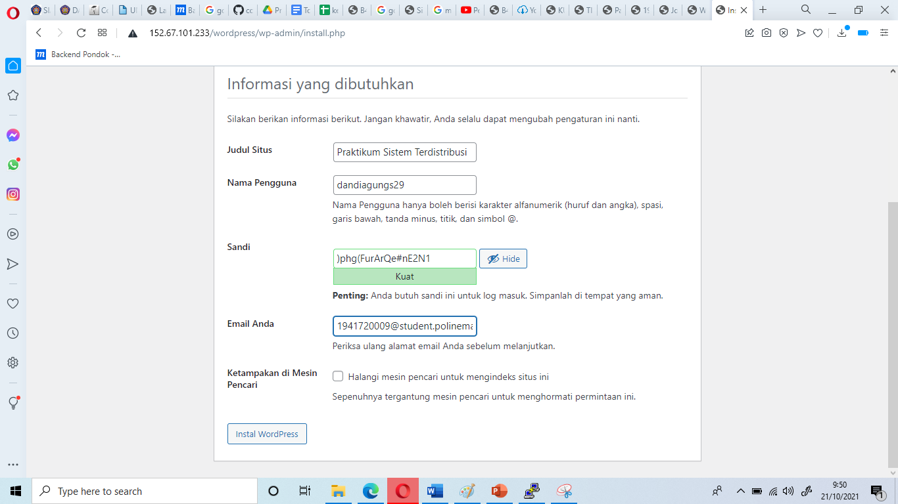
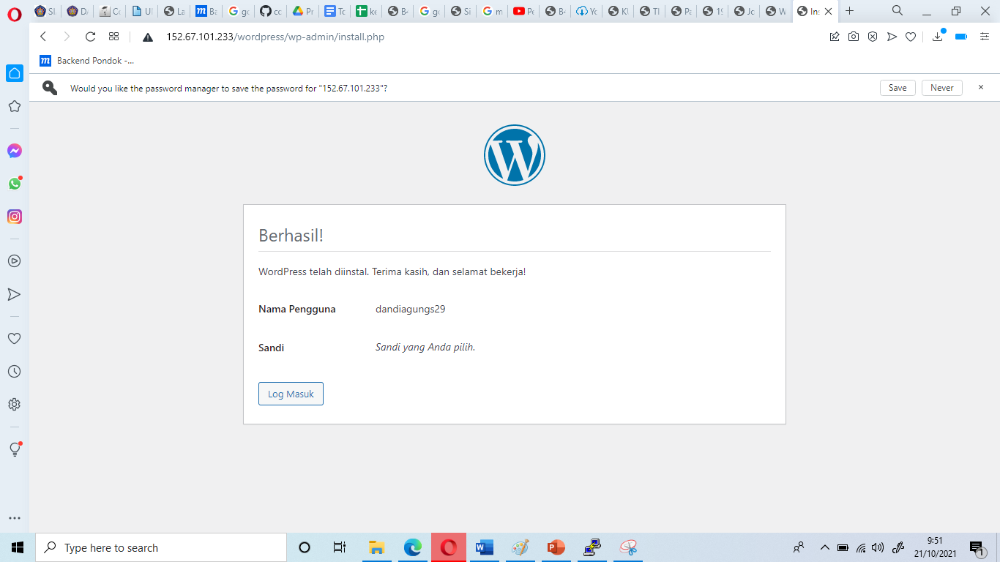

Langkah 1 : Akses instance dengan menggunakan putty.
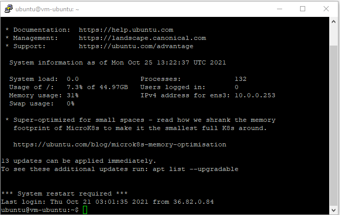
Langkah 2 : Melakukan update dengan perintah sudo apt update.
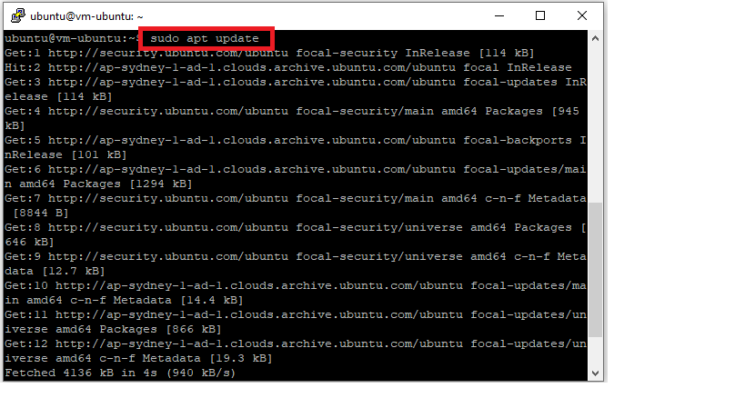
Langkah 3 : Membuat database db_restoran.
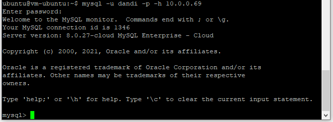
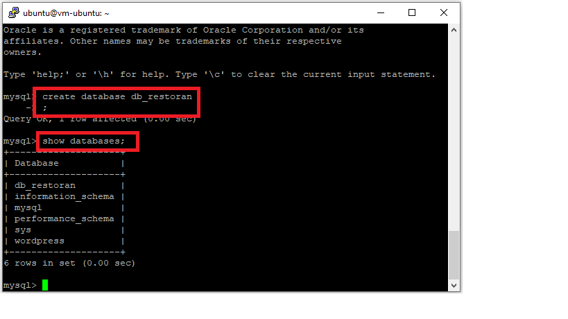
Langkah 4 : Clone repository project ke direktori /var/www/html seperti berikut
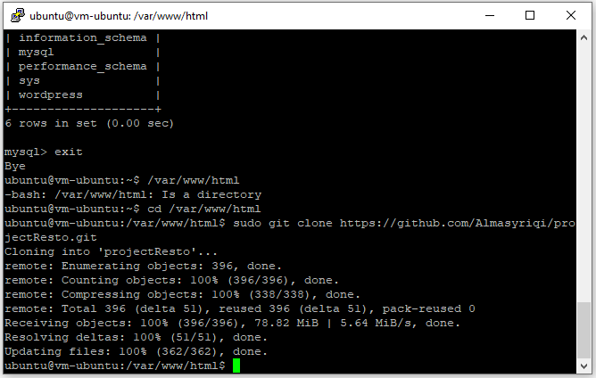
Langkah 5 : Import database db_restoran
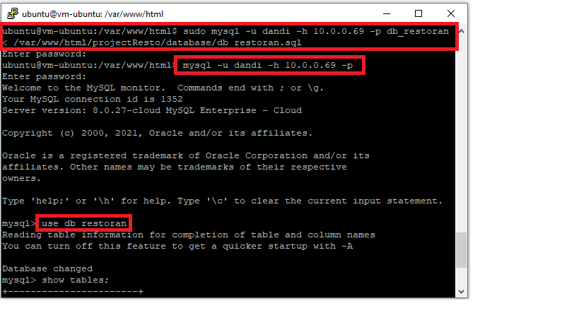
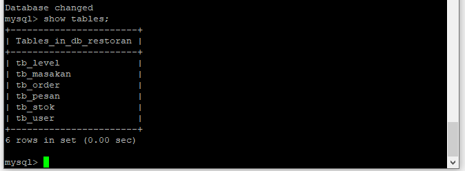
Langkah 6 : Melakukan konfigurasi pada apache.
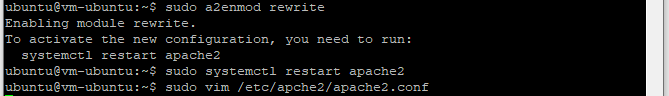

Pada file apache2.conf membuat directory baru kemudian di dalamnya diisi AllowOverride ALL kemudian keluar dengan perintah : wq seperti berikut.
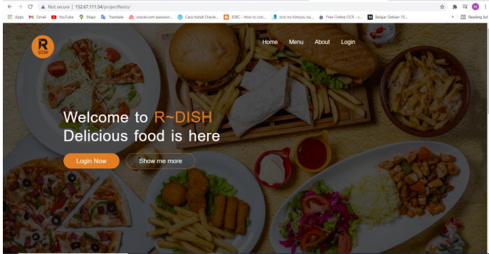
Langkah 8 : Akses aplikasi website php restoran melalui browser dengan mengetikkan url berikut : http://152.67.111.54/projectResto/
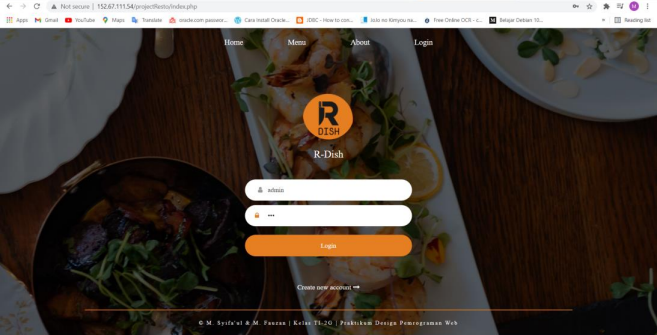
Langkah 9 : Mencoba melakukan login pada website.
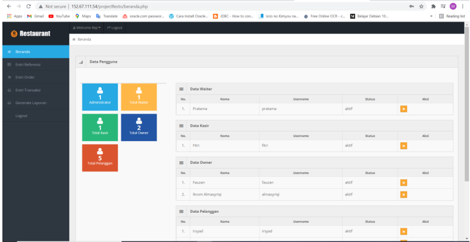
