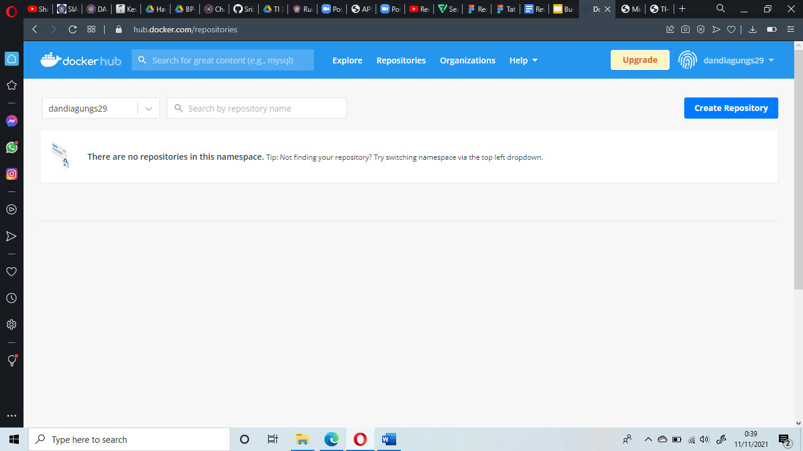

Nama : Edi Irawan 

Kelas TI-3I

Nim : 1941720099

LAPORAN
PRAKTIKUM CLOUD COMPUTING

JOBSHEET 10
DOCKER

Praktikum
1.	Install Docker 
Agar dapat menjalankan container maka diperlukan installasi docker di host, docker sudah support beberapa sistem operasi seperti windows ataupun keluarganya unix. Pada praktikum kali ini akan dilakukan installasi pada Oracle Cloud. Untuk proses installasi silakan mengikuti langkah-langkah di bawah ini 
•	Silakan masuk ke virtual mesin Anda kemudian jalankan perintah di bawah ini :

Tunggu beberapa saat sampai proses update selesai, jika ada dialog yang menginfokan untuk dilakukan upgrade silakan dijawab dengan ‘y’.

•	Install paket yang dibutuhkan sebelum melakukan installasi docker, jalankan perintah di bawah ini :

•	Langkah selanjutnya yaitu menambahkan repository docker, dengan beberapa baris perintah di bawah ini :

Jika kita lihat output dari perintah terakhir menandakan bahwa docker belum terinstall dan sudah ada di repository untuk siap dilakukan installasi. 
 
•	Silakan lakukan installasi menggunakan perintah berikut ini :

Ketika progress installasi sudah selesai, kemudian cek apakah docker daemon sudah jalan menggunakan perintah systemctl.
Jika menampilkan status active (running), berarti docker daemon sudah berjalan. Untuk lebih jelasnya perhatikan output di bawah ini :

•	Untuk memastikan kembali, kita butuh menggunakan image test apakah docker benar-benar berjalan sebagaimana semestinya. Gunakan perintah di bawah ini :

Selamat sudah berhasil melakukan installasi docker dan siap untuk digunakan. 
Jika kita perhatikan perintah-perintah di atas, untuk menjalankan docker harus menggunakan sudo, sedangkan terkadang semua pengguna memiliki image masing-masing. Untuk menjalankan perintah docker tanpa menggunakan sudo, berikut ini perintahnya :

Agar memberikan perubahan, logout terlebih dahulu kemudian login kembali. Jalankan perintah docker tanpa menggunakan sudo seperti berikut :

2.	Membuat Container 
Ketika kita mengembangkan aplikasi web tentunya membutuhkan sebuah web server, hal yang sering dilakukan dengan melakukan installasi paket tersebut diikuti dengan Langkah-langkah yang lain. Dengan docker, kita cukup satu baris perintah apache sudah bisa berjalan. Berikut ini perintahnya :

Perintah di atas digunakan untuk membuat container dengan nama contoh-apache dengan mengexpose port 8080 dari port defaultnya 80, sedangkan image yang digunakan adalah httpd yang merupakan layanan web server apache. Parameter -d digunakan untuk menjalankan containersecara background. Silakan cek menggunakan telnet seharusnya sudah bisa terhubung seperti pada gambar berikut :

Agar port 8080 dapat diakses dari luar, tentunya Anda harus mengkonfigurasi terlebih dahulu firewall di Cloud Oracle-nya.
3.	Membuat Akun Docker Hub 
Pada praktikum yang kedua kita telah memanfaatkan docker untuk menjalankan web server apache, image yang digunakan adalah httpd dengan versi yang terbaru(latest). Ketika kita membutuhkan sebuah image yang spesifik kebutuhan kita tentunya tidak akan menemukan, hal tersebut dapat menjadi alasan agar kita bisa mendefinisikan image sesuai dengan kebutuhan dan dapat digunakan oleh orang lain. Setelah membuat image kita perlu menyimpan image tersebut pada sebuah repository, yaitu docker hub.
•	Silakan menuju halaman https://hub.docker.com/signup, akan memuat halaman berikut:

•	Jika sudah, menuju halaman Repository. Disini repository saya kosong dikarenakan belum pernah melakukan push repo docker. 

4.	Build Image 
Sebelumnya kita telah membuat akun di docker hub untuk menyimpan image yang kita buat, kita siapkan aplikasi dan konfigurasi docker dengan langkah-langkah sebagai berikut :
•	Clone project yang terdapat di https://gitlab.com/0d3ng/cloud-docker-java-sample.git

Masuk ke dalam direktori tersebut dan jalankan perintah build seperti berikut :

•	Jika sudah jalankan container menggunakan image yang telah Anda buat menggunakan perintah berikut. Jika berhasil, maka akan menampilkan string “Hello docker. 😊”.

•	Jika berhasil, maka akan menampilkan string “Hello docker. 😊”.
Jika kita ingin upload ke docker hub kita, silakan login dulu menggunakan perintah di bawah ini :

Selanjutnya kita upload image yang telah kita buat menggunakan perintah di bawah ini :

Push file berhasil dilakukan.

Tugas
1.	Buatlah laporan dan dokumentasi dari praktikum yang Anda lakukan. 
2.	Silakan build image aplikasi Anda sendiri kemudian jalankan di Oracle Cloud.

Jawab :
•	Clone repository saya :

•	Masuk direktori tersebut :

•	Menjalankan perintah build seperti berikut :

•	Melakukan run container menggunakan image yang telah dibuat :

•	Selanjutnya upload file tugas ke repo :

