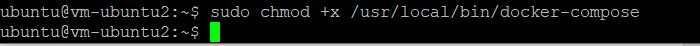

# <b>11 - DOCKER 2</b>

## Tujuan Pembelajaran

1. 1.	Docker Network

## Hasil Praktikum

Berikut ini adalah bukti telah praktikum

## Membuat dan Memeriksa Docker Network
1. Pertama ketik perintah di bawah ini untuk mengetahui network yang tersedia pada docker host kita

2. Selanjutnya untuk mengetahui perintah-perintah dasar yang bisa digunakan untuk docker network

3. Untuk membuat network bisa menggunakan perintah create seperti pada gambar di bawah ini

4. Selanjutnya cek network yang sudah dibuat menggunkan perintah ls, seharusnya akan menambahkan network. Hasilnya adalah sebagai berikut

5. Terakhir, ketika ingin mengetahui informasi detail dari network yang telah kita buat bisa menggunakan perintah inspect

## Menghubungkan Container ke Network
1. Buat terlebih dahulu contoh container, misalkan kita akan membuat container linux yaitu busybox.

2. Buat container yang kedua menggunakan image linux alphine, buka windows yang baru agar container1 tetap berjalan

3. Kemudian cek masing-masing container tersebut menggunakan perintah ps untuk mengetahui status container yang sedang jalan. Buka windows baru, jalankan perintah berikut

4. Kemudian jalankan inspect untuk mengetahui informasi detail dari masing-masing container.

5. Untuk membuktikan silakan ping dari container1 ke container2, seharusnya akan reply.

## Membuka Port Container
1. Misalkan kita ingin membuat image dari apache, layanan httpd. Bisa dilakukan dengan perintah di bawah ini

2. Silakan cek menggunakan telnet terhadap port yang di-expose, seharusnya akan menghasilkan output seperti berikut

3. Kemudian untuk mengetahui port yang dilakukan expose pada container, bisa menggunakan perintah di bawah ini

## Docker Volume
2.1.	Membuat Volume
1. Buat terlebih dahulu folder di host(laptop/computer/vps), misalkan saya buat folder docker-shared.

2. Selanjutkan jalankan perintah dengan menambahkan parameter -v seperti berikut untuk mapping ke container yang akan kita buat, jangan lupa untuk masuk direktori volume, dan membuat file log.txt

3. Cek di folder local Anda, bisa menggunakan perintah ls atau dir. Dapat juga dilihat menggunakan windows explorer.

Setelah kita melakukan mapping volume dari container ke local direktori, kemudian kita akan membuat volume pada docker.
4. Perintah pertama yang bisa dijalankan adalah sebagai berikut, mengecek volume yang telah ada sebelumnya.

5. Untuk membuat volume bisa menggunakna perintah di bawah ini

6. Jalankan container dengan menyertakan volume yang telah kita sebelumnya dan buat file log.txt, jangan lupa masuk ke direktori volume terlebih dahlulu.

## Menghapus Volume

## Docker Compose
1. Silakan masuk ke oracle cloud dan ke VM Anda, kemudian install docker compose dengan perintah sudo curl -L "https://github.com/docker/compose/releases/download/1.27.4/docker-compose-$(uname -s)-$(uname -m)" -o /usr/local/bin/docker-compose

2. Ubah docker compose menjadi executable menggunakan command berikut

3. Cek versi docker compose untuk memastikan proses installasi berhasil dilakukan dengan perintah

4. Clone repo yang telah disediakan menggunakan git atau download secara manual.

5. Masuk ke direktori tersebut dan ganti branch menjadi cloud-docker dengan perintah seperti berikut ini

6. Build image tersebut menggunakan perintah build pada docker.

7. Selanjutnya buat folder data di bawah /opt agar data mysql tidak hilang ketika container dihapus

8. Jalankan docker compose menggunakan perintah berikut ini

10. Untuk mengetahui container yang sedang berjalan menggunakan docker compose bisa dilakukan menggunakan cara sebagai berikut
