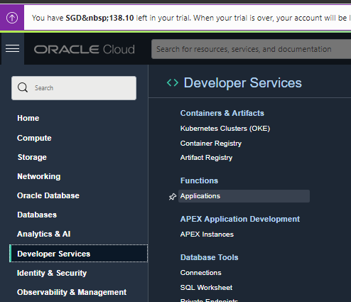
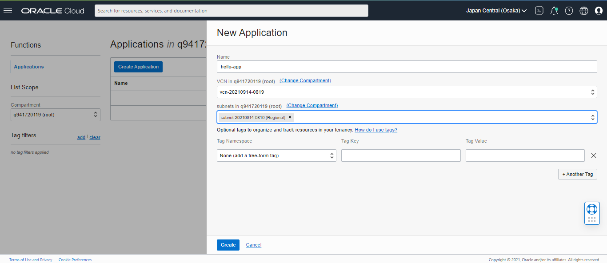
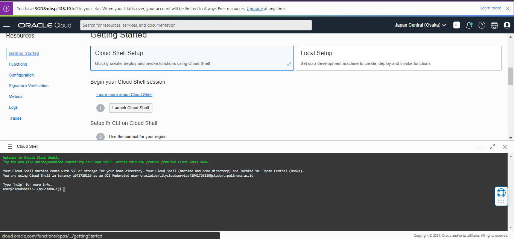
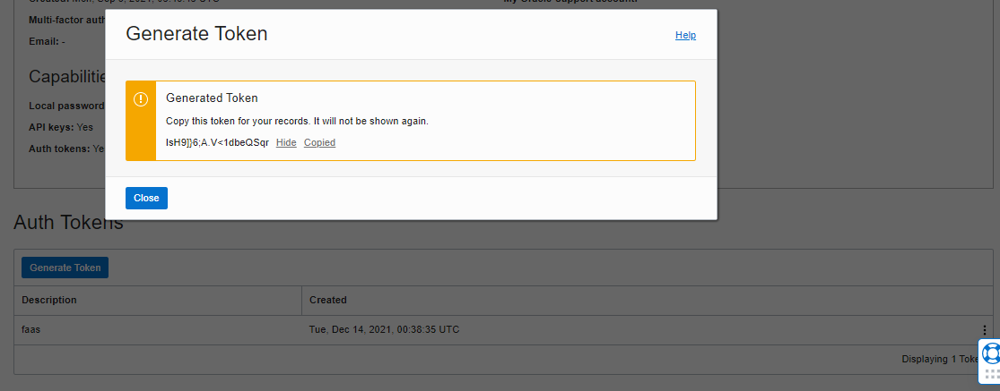
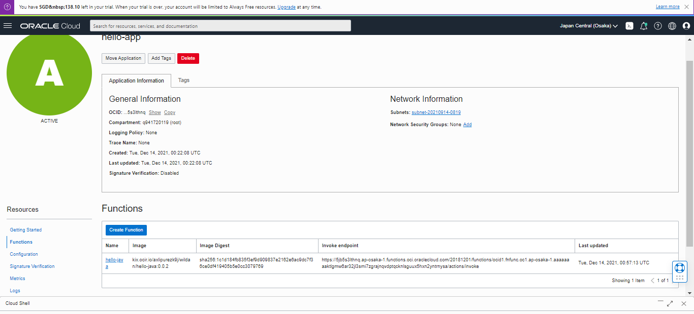

# 14 - Serverless

## Hasil

### 1. Hello World Function

1. a. Masuk ke akun https://cloud.oracle.com dan navigasi ke menu Developer Services -> Applications
   

2. Tekan tombol Create Application dan lengkapi informasi form Name dengan hello-app. Lengkapi juga VCN dan subnet yang dibutuhkan. Jika anda belum mempunyai VCN, silahkan membuat terlebih dahulu VCN.
   

3. Tekan tombol create dan tunggu sampai muncul halaman Getting Started.

4. Pada halaman Getting Started terdapat contoh langkah-langkah deploy menggunakan perintah fn. Terdapat dua pilihan deploy, melalui Cloud Shell Setup atau Local Setup.

5. Aktifkan Cloud Shell dengan menekan tombol Launch Cloud Shell. Tunggu proses provisioning cloud shell selesai. Anda akan mendapatkan sebuah terminal built-in yang dapat digunakan untuk melakukan proses deployment.
   

6. Ikuti langkah-langkah dengan melakukan copy perintah kemudian tempelkan ke dalam terminal Cloud Shell.

7. Perhatikan pada langkah ke 4, ubah nilai [repo-name-prefix] menggunakan username / repository name. Sebagai contoh: polinema

8. Pada langkah ke 5, dilakukan proses pembuatan token untuk autentikasi. Tekan tombol Generate Token dan lengkapi form Description dengan nama yang relevan (contoh: faas). Simpan token tersebut.
   

9. Token yang didapatkan, akan digunakan untuk autentikasi pada langkah ke 6. Tempel token yang didapatkan dan pastikan proses login telah berhasil.

10. Ikuti langkah-langkah sampai anda dapat menampilkan tampilan “Hello, world!”.
    

11. Navigasi menu ke Functions di sebelah kiri bawah. Anda akan mendapatkan detil fungsi yang tersedia. Pada halaman ini terdapat informasi mengenai Functions, serta invoke endpoint yang dapat digunakan untuk pemanggilan function.
    

### 2. Memanggil Function

1. Selain menggunakan fn, Function pada FaaS dapat juga dipanggil menggunakan oci-cli.

2. Salin invoke endpoint kemudian panggil dengan format perintah sebagai berikut.
   
