# 08 - OBJECT STORAGE (OS)

## Tujuan Pembelajaran

1. Mengetahui Object Storage yang ditawarkan Oracle Cloud Infrastructure (OCI)
2. Dapat memanfaatkan layanan Object Storage yang ditawarkan Oracle Cloud Infrastructure (OCI)

# Hasil Praktikum

Berikut ini adalah dokumentasi praktikum Object Storage.

---
## Praktikum 
### Langkah 1
Lakukan koneksi ke instance menggunakan putty seperti praktikum sebelumnya lalu masuk/connect ke dalam DBSystem
setelah connect maka lakukan pembuatan database terlebih dahulu.
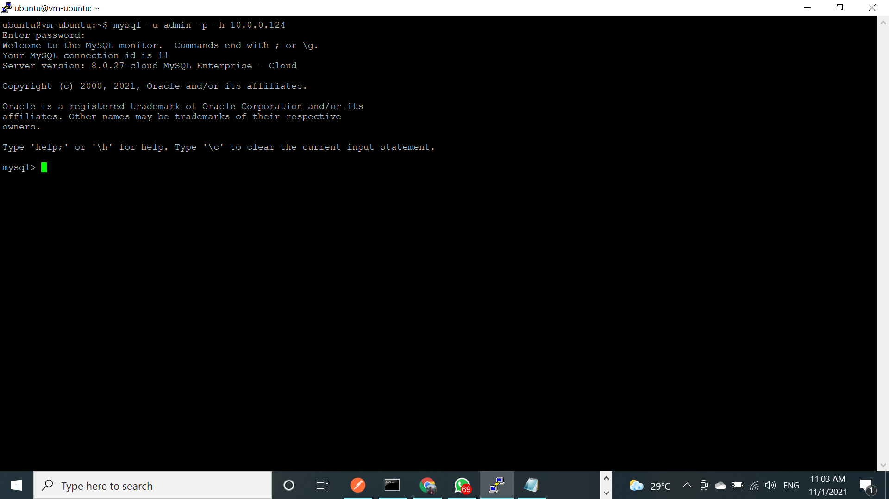
setelah membuat database maka lakukan pengecekan bahwa database sudah benar benar terbuat.
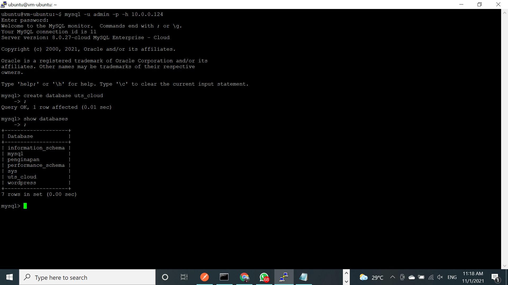

### Langkah 2
selanjutnya lakukan upload project ke dalam vm/instance.
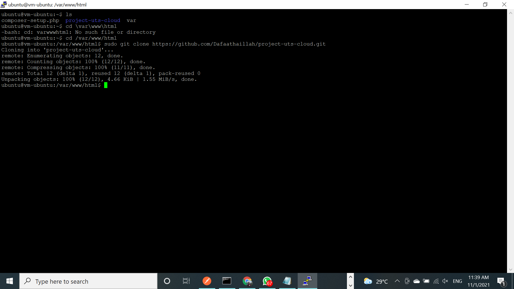

### Langkah 3
selanjutnya masuk ke dalam object storage yang pernah di buat pada praktikum sebelumnya dan pada bucket praktikum sebelumnya tambahkan asset project yang kita upload.
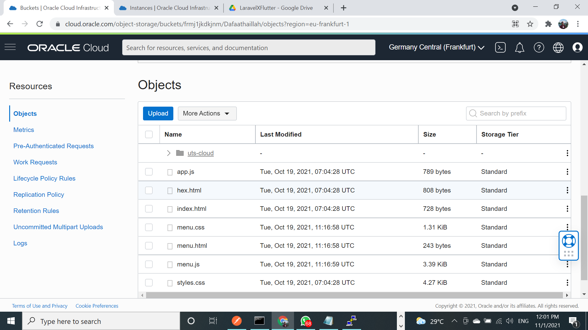
di dalam folder UTS terdapat asset dari project:
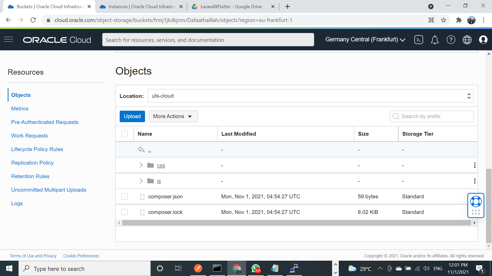
berikut asset dari css:
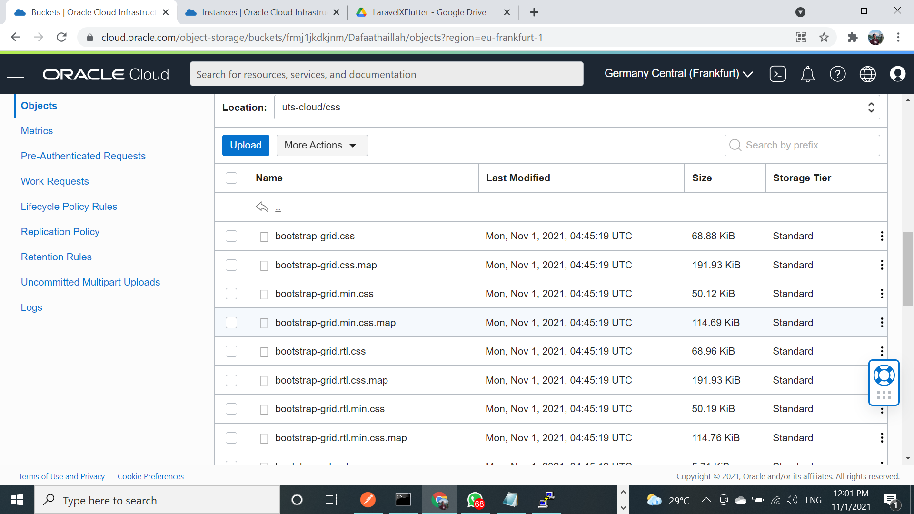
berikut asset dari js:

### Langkah 3
lakukan update codingan untuk mengganti href css menjadi pasth url pada bucket, disini saya sudah melakukan update codingan lalu saya push pada langkah ini saya memberi screenshoot ketika saya pull project:
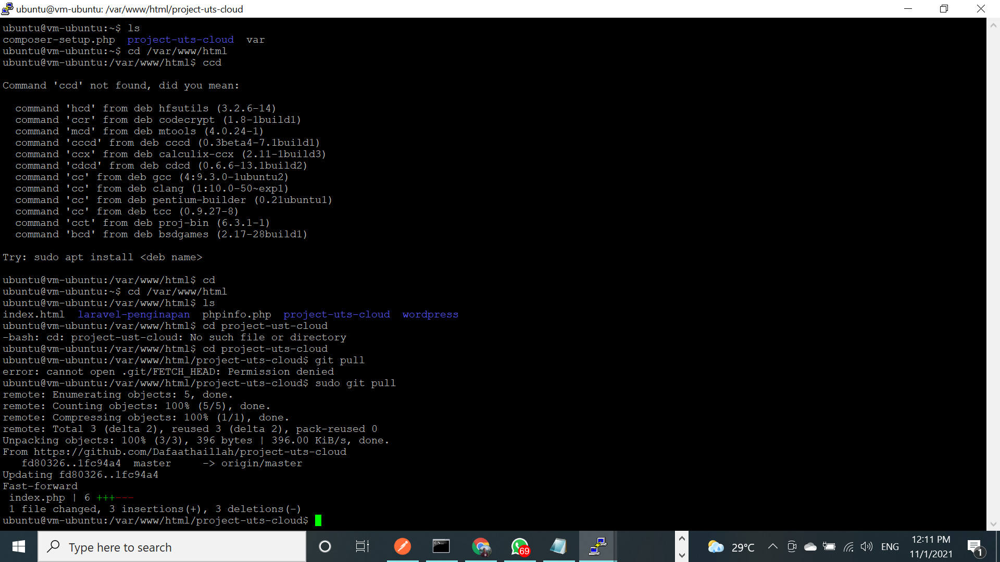
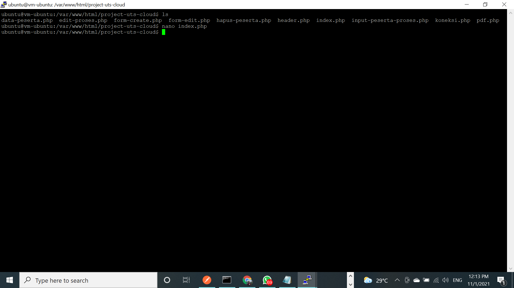

### Langkah 3
lalu jalankan project dengan menggunakan ip public:
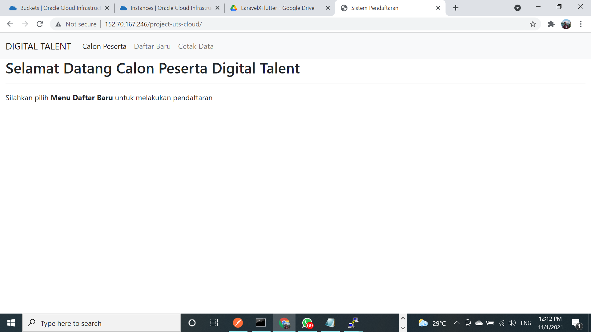
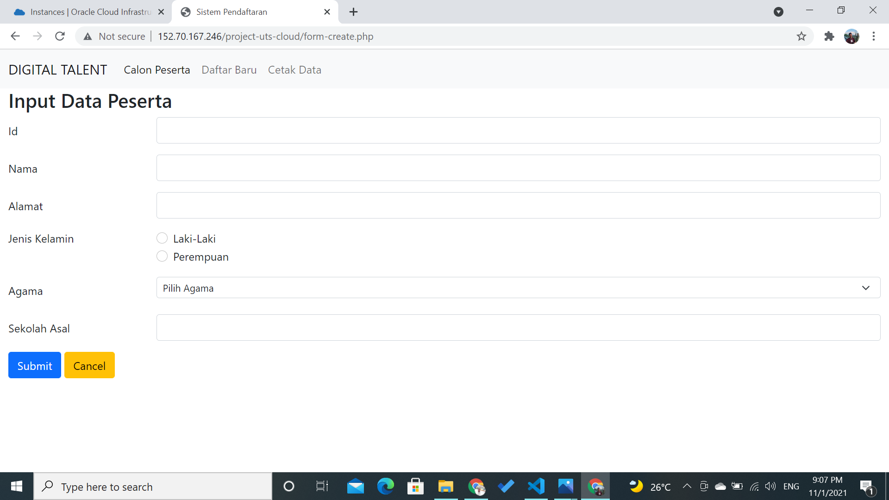
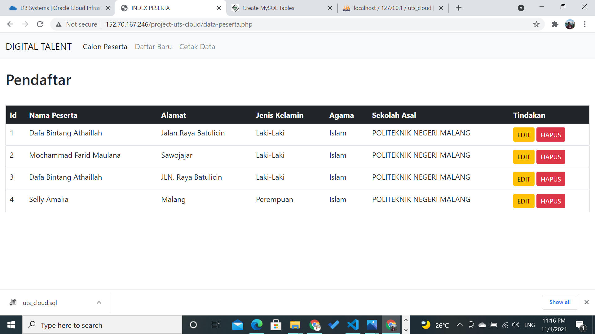
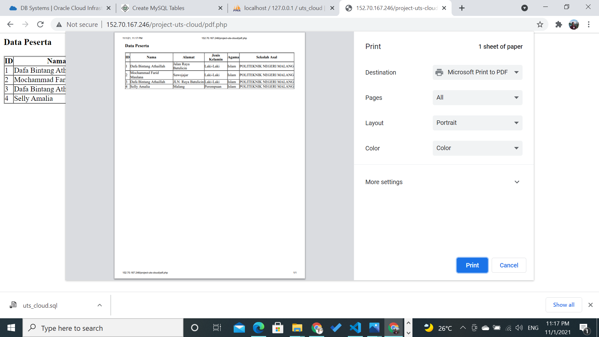
---

# UTS COMPLETE | Terimakasih 